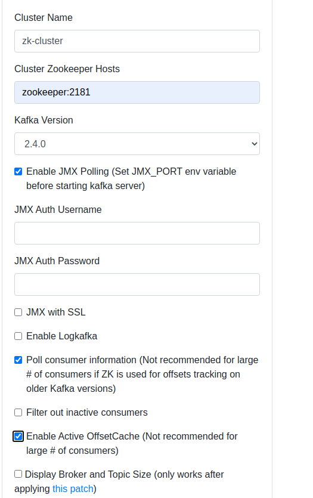

# Apache Kafka와 ELK 스택을 이용한 데이터 파이프라인 구축

[source](http://selftuts.com/create-data-pipeline-using-kafka-and-elasticsearch-logstash-kibana/)

## 아키텍처


- Producer: 데이터를 카프카 토픽에 발행(publish)하는 역할을 합니다. 실제로는 웹서버의 로그나 각종 이벤트 소싱들이 이에 해당합니다. 여기서는 간단한 예시로 파이썬 데이터 생성기인 `faker`를 사용하여 임의의 유저 데이터를 카프카로 발행합니다.

- Kafka Server : 각 토픽에 데이터가 쌓여 consumer에게 스트리밍하는 미들웨어입니다.

- Elasticsearch : Logstash로부터 읽은 데이터를 저장합니다. 

- Logstash : 카프카의 토픽을 읽어 Elasticsearch로 전달합니다. 어떤 토픽을 읽을 것인지 conf(logstash-pipeline.conf)에 명시할 수 있습니다. 

- Kibana : Elasticsearch의 데이터를 읽어 시각화합니다. 

## 요구사항

- `Docker` 가 필요합니다.
- `Docker-compose` 가 필요합니다.
- `python3`와 `pip3` 가 필요합니다.
  - **faker**, **kafka-python** 모듈을 필요로 합니다.
- `logstash` 가 필요합니다.

## 사용 방법

```bash
git clone https://github.com/TayPark/kafka-and-elk-example
cd kafka-and-elk-example

docker-compose -f elasticsearch.yml up -d
docker-compose -f kafka.yml up -d

sudo cp ./logstash-pipeline.conf /etc/logstash/conf.d
systemctl start logstash

python3 producer.py
```

### CMAK

이후 데이터가 발행이 되기 시작하면, 웹에서 CMAK(kafka-manager)로 클러스터를 생성합니다. `localhost:9000` 에 접속하여 클러스터를 만듭니다.



- Cluster Zookeeper Hosts: **zookeeper:2181**를 입력합니다.
- 아래의 옵션을 체크합니다.
  - Enable JMX Polling (Set JMX_PORT env variable before starting kafka server)
  - Poll consumer information (Not recommended for large # of consumers if ZK is used for offsets tracking on older Kafka versions)
  - Enable Active OffsetCache (Not recommended for large # of consumers)

이는 현재 클러스터가 1개이기에 사용합니다.

토픽을 설정합니다. 만약 파이썬 코드를 이미 실행중이라면 토픽이 존재할 수 있습니다.

토픽은 producer의 발행 이름과 같아야합니다. `registered-user`를 입력하고 만듭니다.

### Kibana

접속이 되면 맨 좌측 메뉴 중 아래의 `Management` - `Kibana` - `Index Patterns` - `Create Index pattern` 에 CMAK에서 입력한 토픽의 이름을 입력합니다.

메뉴에서 Discover에서 데이터가 들어오는 것을 확인할 수 있습니다.
